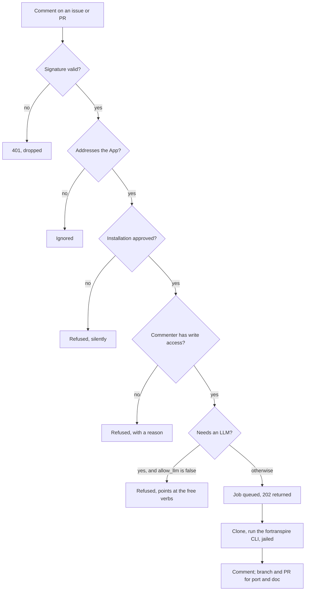

# GitHub App — `/fortranspire` commands on issues and PRs

*Issue [#50](https://github.com/maurinl26/fortranspire/issues/50).*

The App turns a comment into a pipeline run. A maintainer writes this on a
pull request:

```
/fortranspire explain src/common/turb/mode_thermo.F90
```

and the App replies with the port-cost report. Ask it to `port` instead and
it opens a pull request with the transformed kernel.

It is one of three agent surfaces, and the heaviest. Before reaching for it:

| Surface | Trigger | Cost | Use when |
| ------- | ------- | ---- | -------- |
| [Composite Action](../../README.md#-github-action-zero-token-ci) | every PR | free, no secret | you want analysis in CI |
| [Copilot cloud agent](copilot-coding-agent.md) | assign an issue | free, no secret | your team already uses Copilot |
| [Claude Code Action](claude-code-action.md) | `@fortranspire` comment | tokens | one-off ports from a PR |
| **GitHub App** (this page) | `/fortranspire` comment | tokens | you operate it for several repos |

The App earns its complexity when you run it for more than one repository:
it installs one-click, carries its own identity and permissions, and gates
each installation separately.

## Commands

```
/fortranspire <verb> <path> [options]
```

| Verb | LLM? | What it does |
| ---- | ---- | ------------ |
| `explain` | no | Port-cost and risk estimate |
| `analyze` | no | GPU-portability findings (`--fail-on error\|warning\|note`) |
| `graph` | no | Mermaid call-graph |
| `port` | **yes** | Phase-1 transformation (`--target gpu\|jax`), opens a PR |
| `doc` | **yes** | Injects `!>` docstrings, opens a PR |

The command must start a line. Commands inside code fences or quoted (`>`)
lines are ignored, so pasting an example into a comment does not fire a run.
One path per command; paths are repository-relative and `..` is refused.

## What the App will not do

- **Run for an installation you have not approved.** With no allow-list
  configured it refuses everything, silently. Failing closed is the only
  safe default for a public webhook.
- **Run for a non-maintainer.** The commenter needs `write` or `admin` on
  the repository. A failed permission lookup counts as *no* permission.
- **Spend tokens unless you opted that installation in.** `allow_llm`
  defaults to `false`, so `explain`/`analyze`/`graph` work while `port`
  and `doc` are refused with a pointer to the free verbs.
- **Read outside the checkout.** Paths are resolved and jailed against the
  clone, symlinks followed first.
- **Expose an LLM key to a free verb.** `MISTRAL_API_KEY` and friends are
  stripped from the subprocess environment for `explain`, `analyze` and
  `graph` — those are advertised as costing nothing, so the key is not
  reachable from them.

## Setup

### 1. Create the App

Settings → Developer settings → GitHub Apps → New. Set the webhook URL to
`https://<your-host>/webhooks/github`, generate a webhook secret and a
private key, and grant:

| Permission | Level | Why |
| ---------- | ----- | --- |
| Contents | Read & write | clone, push the ported branch |
| Pull requests | Read & write | comment, open the PR |
| Issues | Read & write | comment on issues |
| Metadata | Read | mandatory |

Subscribe to **Issue comment** and **Pull request review comment**.

### 2. Configure the allow-list

Nothing runs until this file exists. One entry per installation:

```json
[
  {
    "installation_id": 12345678,
    "repositories": ["my-lab/*"],
    "allow_llm": true,
    "extra_actors": []
  }
]
```

| Field | Default | Meaning |
| ----- | ------- | ------- |
| `installation_id` | — | From the installation URL, or the `installation.id` of any delivery |
| `repositories` | `["*"]` | `fnmatch` patterns against `owner/repo` |
| `allow_llm` | `false` | Whether `port` and `doc` may run |
| `extra_actors` | `[]` | Logins allowed to trigger without write access |

### 3. Run it

```bash
pip install 'fortranspire[github-app]'

export GITHUB_APP_ID=123456
export GITHUB_APP_PRIVATE_KEY_PATH=/run/secrets/fortranspire.pem
export GITHUB_APP_WEBHOOK_SECRET=...            # same value as in the App
export FORTRANSPIRE_APP_INSTALLATIONS=/etc/fortranspire/installations.json
export MISTRAL_API_KEY=...                      # only if allow_llm is true

fortranspire github-app
```

Listens on `:8080`. `GET /health` answers without authentication, for a load
balancer. Put TLS in front of it — GitHub will not send deliveries to a
plaintext endpoint, and the webhook secret is what proves a delivery is real.

### Configuration reference

| Variable | Default | Purpose |
| -------- | ------- | ------- |
| `GITHUB_APP_ID` | — | App id |
| `GITHUB_APP_PRIVATE_KEY` / `_PATH` | — | RS256 key, inline PEM or a path |
| `GITHUB_APP_WEBHOOK_SECRET` | — | Required; deliveries are refused without it |
| `FORTRANSPIRE_APP_INSTALLATIONS` | — | Allow-list; absent means refuse everything |
| `FORTRANSPIRE_APP_HOST` / `_PORT` | `0.0.0.0` / `8080` | Bind address |
| `FORTRANSPIRE_APP_WORKERS` | `2` | Concurrent jobs |
| `FORTRANSPIRE_APP_JOB_TIMEOUT` | `1800` | Per-job ceiling, seconds |

## How a request flows



The webhook always answers immediately: GitHub retries a delivery it does
not get an answer to within ten seconds, and a Phase-1 port takes minutes.
The outcome arrives as a comment.

## Operating notes

- **Every verb shells out to the `fortranspire` console script**, the same
  one the CLI and the MCP server use. The App adds a trigger and an
  authorisation layer, not a second implementation.
- **The perf diff is structural, not wall-clock.** After a `port` the App
  runs `fortranspire bench`, which reports routine, pragma and file counts,
  generated bytes and LLM cost. Runtime speedup would need a GPU on the
  worker; the report says which one you are looking at.
- **Audit trail.** Every refusal is logged with the actor, the repository
  and the reason. Installation tokens are never logged — `InstallationToken`
  redacts itself in `repr`, which is what tracebacks print.
